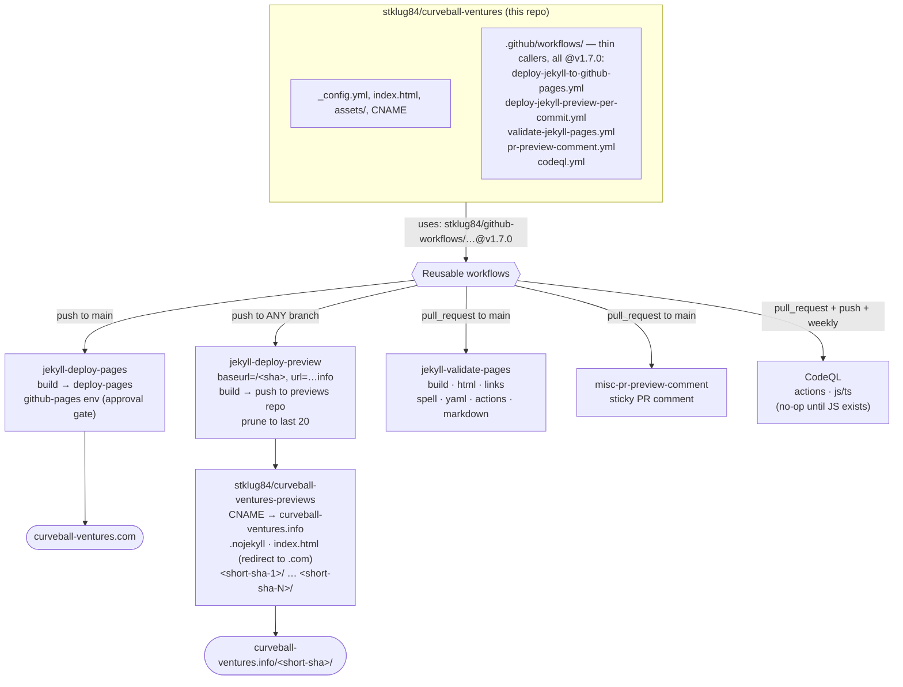

# Curveball Ventures

[](https://github.com/stklug84/curveball-ventures/actions/workflows/validate-jekyll-pages.yml)
[](https://github.com/stklug84/curveball-ventures/actions/workflows/deploy-jekyll-to-github-pages.yml)
[](https://github.com/stklug84/curveball-ventures/actions/workflows/deploy-jekyll-preview-per-commit.yml)
[](https://github.com/stklug84/curveball-ventures/actions/workflows/codeql.yml)

Source repository for the production website at **[curveball-ventures.com](https://curveball-ventures.com)** and the
per-commit preview site at **[curveball-ventures.info](https://curveball-ventures.info)**.

This README documents the entire deployment architecture, branching model, CI pipeline, and operational runbook. It is
intended both as onboarding material for new contributors and as a reference for the repository author.

> **Workflows are thin callers.** All build, deploy, preview, validation, and PR-comment logic lives in the central
> reusable workflows in [`stklug84/github-workflows`](https://github.com/stklug84/github-workflows), pinned to `@v1.7.0`.
> The workflow files in this repo only declare triggers, permissions, concurrency, and inputs/secrets, then delegate via
> `uses:`. Behavioral details below describe what the reusable workflows do on this repo's behalf.

---

## Table of contents

- [Overview](#overview)
- [Architecture](#architecture)
- [Repositories](#repositories)
- [Domains and DNS](#domains-and-dns)
- [Local repository layout](#local-repository-layout)
- [Workflows](#workflows)
  - [Production deploy (`deploy-jekyll-to-github-pages.yml`)](#production-deploy-deploy-jekyll-to-github-pagesyml)
  - [Preview deploy (`deploy-jekyll-preview-per-commit.yml`)](#preview-deploy-deploy-jekyll-preview-per-commityml)
  - [PR validation (`validate-jekyll-pages.yml`)](#pr-validation-validate-jekyll-pagesyml)
  - [PR preview comment (`pr-preview-comment.yml`)](#pr-preview-comment-pr-preview-commentyml)
  - [Code scanning (`codeql.yml`)](#code-scanning-codeqlyml)
- [Branching and PR process](#branching-and-pr-process)
- [Governance: the "Deploy productive" ruleset](#governance-the-deploy-productive-ruleset)
- [Secrets and environments](#secrets-and-environments)
- [Linters and code checks](#linters-and-code-checks)
- [Local development](#local-development)
- [Operational runbook](#operational-runbook)
- [Security model](#security-model)
- [FAQ and design rationale](#faq-and-design-rationale)

---

## Overview

The site is a [Jekyll](https://jekyllrb.com/) static site hosted on GitHub Pages. Two domains are served from two
separate repositories:

| Domain | Repository | Purpose | Trigger |
|---|---|---|---|
| `curveball-ventures.com` | `stklug84/curveball-ventures` (this repo) | Production website | Merge to `main` |
| `curveball-ventures.info` | `stklug84/curveball-ventures-previews` | Per-commit previews under `/<short-sha>/` | Every push, any branch |

The split exists because **GitHub Pages permits only one custom domain (`CNAME`) per repository**. Hosting both domains
from one repo is not possible without an external CDN, so the previews repo is a dedicated, write-only target for build
output.

The previews site also serves a plain top-level `index.html` that **HTTP-200 redirects** any visitor of
`curveball-ventures.info/` to `curveball-ventures.com/`. Individual previews remain reachable only by their direct URL
`curveball-ventures.info/<short-sha>/` — there is no index page listing them.

---

## Architecture



Every workflow file in this repo is a thin caller. The diagram's middle row names the **reusable workflows** in
`stklug84/github-workflows` that actually perform the work.

---

## Repositories

### Source repository (this one)

`stklug84/curveball-ventures`

- Holds the Jekyll source: `_config.yml`, `index.html`, `assets/`.
- Holds all GitHub Actions workflows.
- Holds linter configuration files.
- `CNAME` = `curveball-ventures.com` — production custom domain.
- Pages source: GitHub Actions (not branch-based).
- `preview/` is **git-ignored** locally; it is a local checkout of the previews repo for convenience, never committed here.

### Previews repository

`stklug84/curveball-ventures-previews`

- Pages source: `main` branch, root.
- `CNAME` = `curveball-ventures.info`.
- `.nojekyll` present at root — tells GitHub Pages to serve files verbatim without running Jekyll on them (the content
  is already-built Jekyll output).
- `index.html` at root — a minimal HTML page that meta-refreshes to `curveball-ventures.com` (still HTTP 200; the
  redirect is client-side).
- Per-commit folders: `<short-sha>/` — one directory per preview build, populated by the source repo's workflow via
  cross-repo push.
- The workflow keeps the **20 most recently committed** preview directories; older ones are pruned.

---

## Domains and DNS

| Domain | Records |
|---|---|
| `curveball-ventures.com` | Apex A records → `185.199.108.153`, `185.199.109.153`, `185.199.110.153`, `185.199.111.153` |
| `curveball-ventures.info` | Same four GitHub Pages apex A records |

Both domains terminate at GitHub Pages. The custom domain is asserted in each repository's `CNAME` file and in Pages
settings. HTTPS is provided automatically by GitHub Pages (Let's Encrypt) once DNS is validated.

---

## Local repository layout

```
.
├── _config.yml                  # Jekyll config (site title only; baseurl/url set at build time)
├── index.html                   # Production landing page (Jekyll-templated, dark-mode CSS)
├── CNAME                        # curveball-ventures.com
├── assets/
│   └── favicon.svg              # Hand-drawn curveball SVG icon
├── preview/                     # GIT-IGNORED — local clone of the previews repo
│   ├── .nojekyll
│   ├── CNAME                    # curveball-ventures.info
│   └── index.html               # Redirect to .com
├── Gemfile                      # Jekyll 4.3 (+ webrick) — local dev only; CI ignores it
├── .github/
│   ├── CODEOWNERS               # Auto-request review from @stklug84
│   ├── dependabot.yml           # Grouped weekly updates: bundler + github-actions
│   ├── pull_request_template.md # Default PR body
│   └── workflows/               # Thin callers into stklug84/github-workflows@v1.7.0
│       ├── deploy-jekyll-to-github-pages.yml     # Production deploy
│       ├── deploy-jekyll-preview-per-commit.yml  # Per-commit preview deploy
│       ├── validate-jekyll-pages.yml             # PR build + quality checks
│       ├── pr-preview-comment.yml                # PR sticky comment with preview URL
│       └── codeql.yml                            # CodeQL code scanning (actions + js/ts)
├── .cspell.json                 # Spell-check config + allowlist
├── .htmlvalidate.json           # HTML validator ruleset
├── .lycheeignore                # Link-checker URL exclusions
├── .markdownlint.yml            # Markdown lint rules
├── .yamllint.yml                # YAML lint rules
└── .gitignore                   # Excludes preview/, VSCodium files, etc.
```

---

## Workflows

Five workflows live in `.github/workflows/`. They are intentionally decoupled — each has a single responsibility — so
failures or changes in one do not cascade. Each is a **thin caller** that `uses:` a reusable workflow from
`stklug84/github-workflows@v1.7.0`; the caller owns only triggers, permissions, concurrency, and inputs/secrets.

### Production deploy (`deploy-jekyll-to-github-pages.yml`)

Calls `stklug84/github-workflows/.github/workflows/jekyll-deploy-pages.yml@v1.7.0`.

**Triggers**

- `push` to `main` (the normal case — happens automatically after a PR merge)
- `workflow_dispatch` (manual escape hatch from the Actions tab)

**Caller config**

- `permissions: contents: read, pages: write, id-token: write` — the scopes the reusable workflow needs to build and
  publish to Pages.
- `concurrency: { group: "pages", cancel-in-progress: false }`.

**What the reusable workflow does**

1. **Build job**: checkout, `actions/configure-pages`, build with Bundler (the reusable workflow's own Ruby/Jekyll)
   against repo root → `_site/`, upload artifact.
2. **Deploy job**: `actions/deploy-pages` publishes the artifact under `environment: github-pages`, so the GitHub-managed
   `github-pages` environment gates the deploy.

**Why the environment matters**
The `github-pages` environment is configured (manually, in repo settings) with:

- **Required reviewer**: `@stklug84` — every production deploy pauses for explicit approval.
- **Deployment branches**: `main` only.

This means even an accidental merge into `main` cannot reach the live site without a deliberate human click. The
approval appears in the Actions run and as a deployment notification.

**Concurrency**
The caller declares `concurrency: { group: "pages", cancel-in-progress: false }`. Multiple in-flight production deploys
queue rather than cancel; the most recent build wins, but neither is interrupted mid-deploy.

### Preview deploy (`deploy-jekyll-preview-per-commit.yml`)

Calls `stklug84/github-workflows/.github/workflows/jekyll-deploy-preview.yml@v1.7.0`.

**Triggers**

- `push` to any branch (`branches: ['**']`)
- `workflow_dispatch`

**Caller config**

- `permissions: contents: read`.
- `concurrency: { group: preview-${{ github.ref }}, cancel-in-progress: false }`.
- Inputs: `previews-repo: stklug84/curveball-ventures-previews`, `preview-domain: https://curveball-ventures.info`.
- Secret: `previews-deploy-token: ${{ secrets.PREVIEWS_DEPLOY_TOKEN }}`.

**What the reusable workflow does**

1. Checkout the source repo with `fetch-depth: 0`.
2. Compute `SHORT_SHA=${GITHUB_SHA:0:7}`.
3. **Override `_config.yml`** runner-locally (never committed back):
   - Add `baseurl: /<SHORT_SHA>` so all `relative_url` references in templates resolve under the subdirectory.
   - Add `url: <preview-domain>` so absolute URLs use the preview domain.
4. Build the site → `_site/`.
5. Checkout the **previews repo** (`previews-repo` input) using the cross-repo PAT (`previews-deploy-token` secret).
6. Stage the build under `<SHORT_SHA>/`. Idempotent for re-runs of the same SHA.
7. **Prune** to the newest 20 preview directories by git-commit timestamp (excluding `.git`, `CNAME`, `.nojekyll`,
   `index.html`); uncommitted dirs are treated as "now" so a fresh run is never pruned in its own run.
8. Commit and push as `github-actions[bot]` (`Preview: <SHORT_SHA> from <branch>`). No-op if nothing changed.
9. Write a job summary with the preview URL, branch, and commit.

**Environment binding**
The reusable workflow's deploy job runs under `environment: previews`. The `previews` environment (configured in this
repo's settings) holds `PREVIEWS_DEPLOY_TOKEN` and explicitly allows **all branches**. This scoping means workflows that
do not declare `environment: previews` cannot read the PAT, reducing accidental exposure.

**Concurrency**
`concurrency: { group: preview-${{ github.ref }}, cancel-in-progress: false }` — one preview build per branch at a time,
no cancellation of in-flight builds. Every commit's preview is preserved.

**Baseurl details**
The `baseurl` override is essential. Without it, a preview at `/abc1234/` would generate `<link
href="/assets/favicon.svg">` (resolving to the previews-repo root, returning 404). With `baseurl: /abc1234`, Jekyll's
`relative_url` filter expands it to `/abc1234/assets/favicon.svg`, which is correct.

### PR validation (`validate-jekyll-pages.yml`)

Calls `stklug84/github-workflows/.github/workflows/jekyll-validate-pages.yml@v1.7.0`.

**Triggers**

- `pull_request` to `main` on `[opened, synchronize, reopened]`

**Caller config**

- `permissions: contents: read`.
- `concurrency: pr-validate-${{ pr.number }}` with `cancel-in-progress: true` — new pushes to the PR branch cancel stale
  runs.

**Checks (reported as `validate / <name>`)**

| Check | What it does |
|---|---|
| `build` | Builds the Jekyll site exactly as production would; uploads `_site/` artifact. |
| `html-validate` | Runs `html-validate` against `_site/**/*.html` using `.htmlvalidate.json`. |
| `link-check` | Runs `lychee` against `_site/` with caching to detect broken internal/external links. Honors `.lycheeignore`. |
| `spell-check` | Runs `cspell` against tracked text files using `.cspell.json`. |
| `yaml-lint` | `yamllint -c .yamllint.yml .github/ _config.yml`. |
| `actions-lint` | `actionlint` against `.github/workflows/*.yml`. Catches workflow syntax errors and shellcheck issues in `run:` blocks. |
| `markdown-lint` | `markdownlint-cli2` against `**/*.md`. |

**Required merge gates**
As of reusable-workflow `v1.7.0` the quality checks dropped `continue-on-error`, so **every check reports a real
pass/fail status**. This repo's `Deploy productive` ruleset now lists **all seven `validate / *` contexts** (plus
`CodeQL` and both `Analyze (...)` legs) as **required status checks** with a strict up-to-date policy, so any red check
**blocks the merge** (see [Governance](#governance-the-deploy-productive-ruleset)).

### PR preview comment (`pr-preview-comment.yml`)

Calls `stklug84/github-workflows/.github/workflows/misc-pr-preview-comment.yml@v1.7.0`.

**Triggers**

- `pull_request` to `main` on `[opened, synchronize, reopened]`

**Caller config**

- `permissions: contents: read, pull-requests: write`.
- `concurrency: pr-preview-comment-${{ pr.number }}` with `cancel-in-progress: true`.
- Input: `preview-domain: https://curveball-ventures.info`.

**What the reusable workflow does**

1. Compute the short SHA from `github.event.pull_request.head.sha`.
2. Upsert a single **sticky** comment (`header: preview-url`) on the PR containing the deterministic preview URL
   (`<preview-domain>/<short-sha>/`), branch name, and full commit SHA.

**Why a separate workflow**
This workflow is intentionally decoupled from `deploy-jekyll-preview-per-commit.yml`. The preview URL is
**deterministic** — it is
`<short-sha>` of the PR head — so the comment can be posted immediately without waiting for the deploy to finish. The
note in the comment ("Preview may take ~30s to become available") manages user expectation. Keeping comment-and-deploy
in separate workflows means a comment-step failure does not delay deploys, and a deploy failure does not silently leave
the PR without a URL.

**Sticky comment behavior**
The `header: preview-url` key tells the action to find any prior comment with that header on the PR and update it in
place, rather than appending a new comment every push. The PR ends with exactly one preview comment, always reflecting
the latest commit.

### Code scanning (`codeql.yml`)

Unlike the other four, this workflow is **self-contained** (modeled on
`stklug84/github-workflows/.github/workflows/codeql.yml`), not a reusable-workflow caller.

**Triggers**

- `pull_request` to `main`
- `push` to `main`
- `schedule`: weekly (`cron: '45 5 * * 1'`) to pick up newly released queries.

**What it does**

- `permissions: contents: read` at the top; the analyze job adds `security-events: write`, `actions: read`.
- `concurrency: codeql-${{ github.workflow }}-${{ github.ref }}` with `cancel-in-progress: true`.
- Matrix over two languages: `actions` and `javascript-typescript`.
  - `actions` analyzes the workflow files themselves (expression injection, excessive permissions, untrusted checkout,
    artifact/cache poisoning, …).
  - `javascript-typescript` is kept for forward-compatibility; the site is currently plain Jekyll/HTML with **no JS**, so
    that leg is a clean no-op until JS/TS is added.
- `github/codeql-action/init@v4` with `build-mode: none` and `queries: security-extended`, then
  `github/codeql-action/analyze@v4`.

CodeQL is **part of the governance ruleset** via its `code_scanning` rule (see below), so a failing analysis blocks the
production deploy path.

---

## Branching and PR process

### Branching model

- `main` — always reflects what is live on `curveball-ventures.com`. Protected by the `Deploy productive` ruleset.
- Feature branches — `feat/...`, `fix/...`, `chore/...`, `docs/...`. Created from `main`.
- Direct pushes to `main` are not allowed by the ruleset. The only way changes reach `main` is via PR + squash merge.

### Lifecycle of a change

1. **Create branch** from `main`:

   ```bash
   git checkout main
   git pull
   git checkout -b feat/landing-copy
   ```

2. **Commit and push** to the feature branch:

   ```bash
   git add .
   git commit -m "Add hero subtitle"
   git push -u origin feat/landing-copy
   ```

   On push, `deploy-jekyll-preview-per-commit.yml` fires, building the site and pushing it to
   `curveball-ventures-previews` under `/<short-sha>/`. The preview is reachable within ~30s.

3. **Open a PR** to `main`. The PR template populates the body with a reviewer checklist.
   - `validate-jekyll-pages.yml` runs the build plus all quality checks (each reporting real pass/fail status).
   - `pr-preview-comment.yml` posts a sticky comment with the preview URL.
   - CODEOWNERS auto-requests review from `@stklug84`.
4. **Review**: open the preview URL, walk through the checklist. Iterate by pushing more commits to the branch — both
   workflows re-run, and the sticky comment updates.
5. **Merge**: once the ruleset's requirements are satisfied (PR review, CodeQL/code-scanning clean, signed commits,
   linear history), **squash-merge**. The branch is auto-deleted.
6. **Deploy**: merging to `main` triggers `deploy-jekyll-to-github-pages.yml`. It builds and queues a deployment to the
   `github-pages` environment, which **pauses for approval**. The approver (you) reviews the production deploy in the
   Actions UI and clicks approve. The site goes live.

### Merge strategy

**Squash merge** is the only enabled strategy in repository settings. Each PR becomes one commit on `main`, named after
the PR title. Consequences:

- `main` history is linear and clean.
- The commit on `main` has a **different SHA** than the last commit on the feature branch. The `.info/<sha>/` preview
  that was reviewed remains at the feature branch's SHA; after merge a new preview is built at the squash commit's SHA.
  Both work; the URL just changes.
- Reverting a PR is a single commit revert.

### Protection on `main`

`main` is governed by the **`Deploy productive`** repository ruleset, not legacy branch-protection rules. See the
dedicated [Governance](#governance-the-deploy-productive-ruleset) section for the full rule list.

### Repo-level merge settings

In **Settings → General → Pull Requests**:

- ❌ Allow merge commits
- ✅ Allow squash merging — default commit title: PR title; default message: PR description
- ❌ Allow rebase merging
- ✅ Automatically delete head branches after merge

---

## Governance: the "Deploy productive" ruleset

`main` is protected by an **active repository ruleset** named **`Deploy productive`** (Settings → Rules → Rulesets), not
the legacy branch-protection UI. Rulesets are the current GitHub mechanism and compose better with org-level policy. The
ruleset targets the `main` branch and enforces:

This ruleset mirrors the equivalent `Deploy productive` ruleset in `stklug84/skcloud`.

| Rule | Effect |
|---|---|
| `pull_request` | Changes can only land on `main` via a pull request (code-owner review required; 0 required approvals). |
| `creation` / `deletion` | The branch cannot be recreated or deleted out-of-band. |
| `non_fast_forward` | No force-pushes / history rewrites on `main`. |
| `required_linear_history` | Merge commits are rejected — squash only (matches repo merge settings). |
| `required_signatures` | Every commit on `main` must be **signed** (verified GPG/SSH/S-MIME). |
| `required_status_checks` | All ten contexts below must pass (strict: branch must be up to date). |
| `required_deployments` | The **`previews`** environment deployment must succeed — every PR head must have a published preview. |
| `code_scanning` | **CodeQL** results must be clean (`high_or_higher` security alerts; `errors_and_warnings`). |
| `code_quality` | Code-quality gate must pass (severity: warnings). |

**Required status checks** (strict policy — the branch must be up to date before merge):

| Context | Source workflow |
|---|---|
| `validate / build` | `validate-jekyll-pages.yml` |
| `validate / html-validate` | `validate-jekyll-pages.yml` |
| `validate / link-check` | `validate-jekyll-pages.yml` |
| `validate / spell-check` | `validate-jekyll-pages.yml` |
| `validate / yaml-lint` | `validate-jekyll-pages.yml` |
| `validate / actions-lint` | `validate-jekyll-pages.yml` |
| `validate / markdown-lint` | `validate-jekyll-pages.yml` |
| `CodeQL` | `codeql.yml` (aggregate) |
| `Analyze (actions)` | `codeql.yml` |
| `Analyze (javascript-typescript)` | `codeql.yml` |

**Notes**

- The quality checks are now **hard merge gates**, not advisory. Since reusable-workflow `v1.7.0` they already report
  real pass/fail status; the ruleset now also requires them, so a red check blocks the merge.
- **`required_deployments: previews`** means each PR head must produce a successful `previews` environment deployment
  (from `deploy-jekyll-preview-per-commit.yml`). This is why the preview pipeline must run for **every** contributor —
  including **Dependabot** (see the [Dependabot](#dependabot) notes under Secrets and environments).
- **Required signatures** means local commits must be signed (`git config commit.gpgsign true` with a configured signing
  key) or they will be rejected on push to a PR targeting `main`.

---

## Secrets and environments

### Environments

| Environment | Purpose | Branches | Reviewers | Secrets |
|---|---|---|---|---|
| `github-pages` | Production deploy to `.com` | `main` only | `@stklug84` (required) | none (uses `GITHUB_TOKEN`) |
| `previews` | Per-commit preview deploy to `.info` | All branches | none | `PREVIEWS_DEPLOY_TOKEN` |

The `github-pages` environment is auto-created by the `actions/deploy-pages` action. Configure required reviewers and
branch restrictions manually in the UI.

The `previews` environment is created manually. It must allow **all branches** because the preview workflow runs on
every branch push by design.

### `PREVIEWS_DEPLOY_TOKEN`

A fine-grained GitHub Personal Access Token (PAT) used by the source repo's preview workflow to push build output into `stklug84/curveball-ventures-previews`.

- **Scope**: only `stklug84/curveball-ventures-previews`.
- **Permissions**: `Contents: Read and write`.
- **Expiration**: maximum 1 year. Set a calendar reminder to rotate.
- **Storage**: environment secret on the `previews` environment, not a repository-wide secret. This scopes its
  availability to jobs that declare `environment: previews`.

### Why an environment secret instead of a repo secret

A repository secret is exposed to **every** workflow in the repo. An environment secret is exposed only to jobs that
declare that environment. Combined with CODEOWNERS protection on `.github/workflows/**` (which requires the author's
review on any workflow change), this closes the practical exfiltration paths a new contributor would otherwise have
access to.

### Dependabot

Because the `Deploy productive` ruleset requires the `previews` deployment on every PR head (see
[Governance](#governance-the-deploy-productive-ruleset)), the preview pipeline must also run for **Dependabot** PRs —
otherwise grouped Dependabot updates could never satisfy the merge gate.

- **Trigger.** The preview workflow fires on `push: ['**']`, which also matches Dependabot's own branch pushes, so a
  Dependabot update gets a preview at `curveball-ventures.info/<short-sha>/` like any other branch.
- **Secret access.** Dependabot-triggered runs use a **restricted token** and can read secrets **only** from the
  repository's **Dependabot secrets** store — *not* from Actions or environment secrets. `PREVIEWS_DEPLOY_TOKEN` is
  therefore mirrored into **both** the `previews` environment secret (for ordinary runs) and the **Dependabot** secret
  store (for Dependabot runs). Keep the two copies in sync when rotating the PAT.
- **Production deploy.** Dependabot reaches production the normal way — its PR merges to `main`, which triggers
  `deploy-jekyll-to-github-pages.yml`. A commented-out, opt-in `pull_request` path in that workflow can additionally run
  a *pre-merge* production deploy scoped to Dependabot PRs; it is disabled by default because the `previews` preview
  already covers pre-merge review.

---

## Linters and code checks

Each linter has a dedicated config file at the repo root. All run inside the reusable validation workflow invoked by
`validate-jekyll-pages.yml`; as of `v1.7.0` each reports a real pass/fail status (see
[PR validation](#pr-validation-validate-jekyll-pagesyml)).

### `.htmlvalidate.json`

Extends `html-validate:recommended`. Currently relaxed: `no-inline-style: "warn"` (the landing page uses an inline
`<style>` block), `void-style: "off"`, `require-sri: "off"`. Tighten as content grows.

### `.cspell.json`

Project allowlist with terms like `Curveball`, `Jekyll`, `stklug`, `lychee`, `actionlint`. Ignores `_site/**`,
`preview/**`, `.git/**`, `node_modules/**`.

### `.markdownlint.yml`

Shared stklug84 baseline plus Jekyll content deviations. `MD013` line length
120 (tables and code blocks exempt), `MD010` allows hard tabs in code blocks,
`MD024` duplicate headings only flagged among siblings, `MD060` disabled. For
Jekyll-flavored markdown, `MD033` (inline HTML), `MD036` (emphasis as heading),
`MD040` (fenced code language), `MD041` (first line h1) and `MD049` (emphasis
style) are disabled.

### `.yamllint.yml`

Shared stklug84 baseline. `line-length` is a warning at 120 chars,
indentation 2 spaces, `truthy` configured for GitHub Actions' bare `on:` key,
`document-start` enforced (every YAML file begins with `---`).

### `.lycheeignore`

Initially empty. Add regex patterns of URLs to skip when external links prove flaky.

### `actionlint`

No config file — runs against all workflow files with defaults. Catches shell-injection patterns and YAML schema errors
in workflows.

### `.github/dependabot.yml`

Grouped weekly version updates (Monday 06:00 Europe/Berlin), one PR per ecosystem instead of one per dependency:

- **`bundler`** — Jekyll + plugins from the `Gemfile`. Minor/patch grouped into one PR; majors stay separate so breaking
  changes are reviewed individually. Security updates are their own group. Labels `dependencies`, `ruby`; commit prefix
  `chore(deps)`.
- **`github-actions`** — all action and reusable-workflow bumps grouped. Security updates separate. Labels
  `dependencies`, `ci`; commit prefix `ci(deps)`.

---

## Local development

### Prerequisites

- Ruby ≥ 3.1 with Bundler (only if you want to run Jekyll locally; the CI uses `actions/jekyll-build-pages` which
  provides its own Ruby and Jekyll).
- Git.

### Build the site locally

A `Gemfile` is checked in (Jekyll 4.3 + `webrick`, built with Bundler so we control the Jekyll version directly). The CI
build uses `actions/jekyll-build-pages` and does not consume this `Gemfile`; it exists for local development. To preview
locally:

```bash
bundle install
bundle exec jekyll serve
```

Open `http://localhost:4000/`.

### Working with the previews repo

The `preview/` directory is git-ignored in this repo but is a checkout of `stklug84/curveball-ventures-previews`. If you
want to modify the previews repo's `index.html`, `CNAME`, or `.nojekyll`, do so inside `preview/` and push from there:

```bash
cd preview
git pull
# edit files
git add .
git commit -m "Update redirect target"
git push
```

The preview workflow only writes to `<short-sha>/` subdirectories; it never modifies the previews repo's root files.

### Running linters locally (optional)

```bash
# YAML
pipx install yamllint
yamllint -c .yamllint.yml .github/ _config.yml

# Spelling
npm install -g cspell
cspell "**/*.{md,html,yml,yaml}"

# HTML (after a Jekyll build into _site/)
npm install --no-save html-validate
npx html-validate "_site/**/*.html"

# Workflows
brew install actionlint
actionlint
```

---

## Operational runbook

### "I want to ship a change to the live site"

1. Branch from `main`.
2. Commit, push.
3. Open a PR. Watch the sticky comment appear; open the preview URL.
4. Iterate until happy.
5. Merge (squash). Approve the production deploy when the `github-pages` environment prompt appears in the Actions tab.

### "The preview workflow is failing with 403 / authentication errors"

The PAT has likely expired or been revoked. Generate a new fine-grained PAT, update the `PREVIEWS_DEPLOY_TOKEN` secret
in the `previews` environment, and re-run the failed workflow.

### "The production deploy is stuck waiting"

It is paused at the `github-pages` environment approval gate. Open the run in Actions → Review deployments → Approve.

### "I need to roll back production"

- **Preferred**: revert the offending commit on `main` via a new PR. Merging the revert PR triggers a new deploy.
- **Hot path**: re-run the most recent successful `deploy-jekyll-to-github-pages.yml` workflow run via
  `workflow_dispatch` from the
  previous good commit. The ruleset still applies — the workflow runs against whatever commit `main` currently points to,
  so a true rollback still requires a revert PR.

### "I want to delete an old preview manually"

The pruning step keeps the newest 20 by git timestamp. To force a delete:

```bash
cd preview
git pull
rm -rf <short-sha>
git add -A
git commit -m "Remove stale preview <short-sha>"
git push
```

### "I want to force a fresh production deploy without a code change"

Actions tab → **Deploy Jekyll to GitHub Pages** → Run workflow → branch `main`. This is the `workflow_dispatch` escape
hatch.

### "The DNS / HTTPS cert is failing for one of the domains"

Check Settings → Pages in the respective repository. Re-validate the custom domain. Wait up to 24h for certificate provisioning.

---

## Security model

### Trust boundaries

- **`main` is trusted**. The `Deploy productive` ruleset ensures every commit on `main` arrived via PR, is signed, passed
  CodeQL/code-scanning, and was reviewed.
- **Other branches are semi-trusted**. Anyone with write access can push. Their commits trigger the preview workflow but
  not production.
- **PRs from forks** (currently impossible because the repo is single-account, but applicable if it goes public): GitHub
  does not expose secrets to fork PR workflows by default. The preview workflow would not run for fork PRs unless
  explicitly configured otherwise.

### PAT exposure surface

Anyone who can edit `.github/workflows/deploy-jekyll-preview-per-commit.yml` and merge that change can read
`PREVIEWS_DEPLOY_TOKEN`.
Defenses in depth:

1. **CODEOWNERS** on `.github/workflows/**` and `.github/CODEOWNERS` itself — requires code-owner review on any modification.
2. **The `Deploy productive` ruleset** requires a PR, code-owner review, signed commits, and clean CodeQL.
3. **Environment secret** scoping — only jobs declaring `environment: previews` can read the PAT, so a maliciously added
   new workflow has to also declare the environment, which is more visible in review.
4. **Fine-grained PAT** scoped to only the previews repo — even if leaked, blast radius is bounded.

### What this design does *not* protect against

- A compromised author account.
- A malicious code-owner approving their own bad PR (if approvals are raised to 1 from a collaborator).
- The PAT being leaked outside GitHub (e.g. pasted into chat). Rotate immediately if suspected.

### Already in place

- **CodeQL** code scanning (`codeql.yml`), enforced via the ruleset's `code_scanning` rule. The `actions` language is
  analyzed today; the `javascript-typescript` leg activates automatically once JS/TS is added.
- **Required signed commits** on `main` (ruleset).

### Hardening upgrades to consider later

- Replace the PAT with a **GitHub App installation token**: short-lived (~1h), auto-rotating, explicit per-repo permissions.
- Enable **secret scanning** and **push protection** in the repo.
- Add a **CodeQL** language pack for Ruby if non-trivial Ruby/plugins are introduced.

---

## FAQ and design rationale

### Why two domains and two repos?

GitHub Pages allows only one custom domain per repository. We need both a stable production URL and per-commit preview
URLs accessible simultaneously. Two repos is the simplest solution that avoids introducing a third-party host
(Cloudflare Pages, Netlify, etc.).

### Why not Cloudflare Pages or Netlify for previews?

Considered and rejected. Either would give native per-commit preview URLs out of the box, but introduces a third vendor,
a separate auth model, and pricing/quota considerations. The two-repo approach keeps everything inside GitHub.

### Why not a git submodule for the previews repo?

Considered and rejected. A submodule pins a specific commit, meaning the source repo would need a follow-up commit after
every preview push to update the pointer. This adds noise to `main`'s history without operational benefit. The current
design uses a runtime `actions/checkout` of the previews repo, which has identical access without coupling.

### Why is the previews repo's `index.html` a meta-refresh redirect and not a directory listing?

By design: we wanted preview URLs to be **unguessable** by random visitors. The root page sends visitors back to
`curveball-ventures.com`. Individual previews remain accessible to anyone who has the URL (the PR sticky comment, the
workflow summary, or a direct share), but are not enumerable from the root.

### Why HTTP 200 with a meta-refresh instead of a real HTTP 301?

GitHub Pages does not allow custom HTTP status codes for arbitrary paths. A real 301 would require either the
`jekyll-redirect-from` plugin (overkill — would re-enable Jekyll on the previews repo, conflicting with `.nojekyll`) or
an external host. Meta-refresh is functionally equivalent for users and well-understood by search engines, especially
when paired with `<link rel="canonical">`.

### Why are the lint checks required merge gates?

The `Deploy productive` ruleset enforces the full set of gates that matter for a static site — a PR with code-owner
review, signed commits, a clean **CodeQL** scan, a successful **`previews`** deployment, and **all seven `validate / *`
lint contexts** — so a red check blocks the merge. Since reusable-workflow `v1.7.0` the lint checks report real
pass/fail status (no more `continue-on-error`), which is what makes them safe to require. This mirrors the equivalent
ruleset in `stklug84/skcloud` so the two repos enforce the same bar.

Note that `required_deployments` points at the **`previews`** environment, not `github-pages`: the gate is "this PR head
published a working preview", which every contributor (including Dependabot) can satisfy before merge. Production
(`github-pages`) deploys only after the PR merges to `main`.

### Why is `prefers-color-scheme` dark-mode support inline in the page?

The site is currently a single page with a heading. An external stylesheet would add one HTTP request and a separate
file to manage for ~15 lines of CSS. As the site grows, extract to `assets/main.css`.

### Why does the workflow only keep 20 previews?

Pragmatic balance: enough to compare branches across a sprint, few enough that the previews repo doesn't bloat. The
prune count lives in the reusable workflow (`stklug84/github-workflows`), so adjusting it is a change there (and a
version bump in this repo's caller), not a local edit.

### What happens if I push the same commit twice (e.g. force-push, rebase)?

The preview workflow runs again. The `<short-sha>` directory in the previews repo is deleted and re-created; the commit
message in the previews repo reflects the new push. No corruption, no duplicate previews.

### What if two branches contain the same commit SHA?

Both pushes target the same `<short-sha>/` folder. The first push deploys, the second push sees no content change and
skips the commit (`git diff --cached --quiet && exit 0`). The preview reflects whichever ran first; both branches' PR
comments point to the same valid URL.

### Why is the `.com` build's `_config.yml` minimal (just `title:`)?

The production deploy serves the site at the apex of `curveball-ventures.com`, so `baseurl` is empty and `url` would
only matter for absolute URL helpers (which the current page doesn't use). The preview workflow adds those keys at build
time. Keeping `_config.yml` minimal avoids confusion about whether values apply to prod, preview, or both.

### How do I add a new linter to the PR pipeline?

The quality checks live in the reusable workflow (`jekyll-validate-pages.yml` in `stklug84/github-workflows`), so a new
linter is added there, not in this repo:

1. Add the check job to the reusable workflow in `stklug84/github-workflows`; release a new tag.
2. Add the linter's config file at this repo's root if it needs one.
3. Bump the `@v…` ref in `validate-jekyll-pages.yml` (Dependabot's `github-actions` group will also offer this).
4. Open a PR, verify the new check runs.
5. Optionally promote it to a required gate by adding its context to the `Deploy productive` ruleset.

---

## Quick reference

### Key URLs

- Production: <https://curveball-ventures.com>
- Previews root (redirects): <https://curveball-ventures.info>
- Preview pattern: `https://curveball-ventures.info/<short-sha>/`

### Key files

- `.github/workflows/deploy-jekyll-to-github-pages.yml` — production deploy (caller)
- `.github/workflows/deploy-jekyll-preview-per-commit.yml` — preview deploy (caller)
- `.github/workflows/validate-jekyll-pages.yml` — PR CI (caller)
- `.github/workflows/pr-preview-comment.yml` — PR sticky comment (caller)
- `.github/workflows/codeql.yml` — CodeQL code scanning
- `.github/dependabot.yml` — grouped weekly updates (bundler + github-actions)
- `.github/CODEOWNERS` — review routing
- `_config.yml` — Jekyll site config (title only)
- `index.html` — production landing page

### Key commands

```bash
# Start a change
git checkout -b feat/your-thing main

# Push (triggers preview)
git push -u origin feat/your-thing

# Sync the local previews repo
cd preview && git pull && cd ..

# Manual production deploy (escape hatch)
# Actions tab → "Deploy Jekyll to GitHub Pages" → Run workflow
```

### Maintenance calendar

- **PAT rotation**: ~2 weeks before `PREVIEWS_DEPLOY_TOKEN` expires (max 1 year). GitHub emails reminders.
- **Dependabot PRs**: weekly (Monday), grouped per ecosystem; merge after `validate / build` and CodeQL pass.
- **Reusable-workflow bumps**: review `github-workflows@vX.Y.Z` bumps from Dependabot's `github-actions` group.
- **Lint check review**: revisit the quality checks quarterly; promote stable ones to ruleset-required.

---

*Last updated: 2026-06-22*
